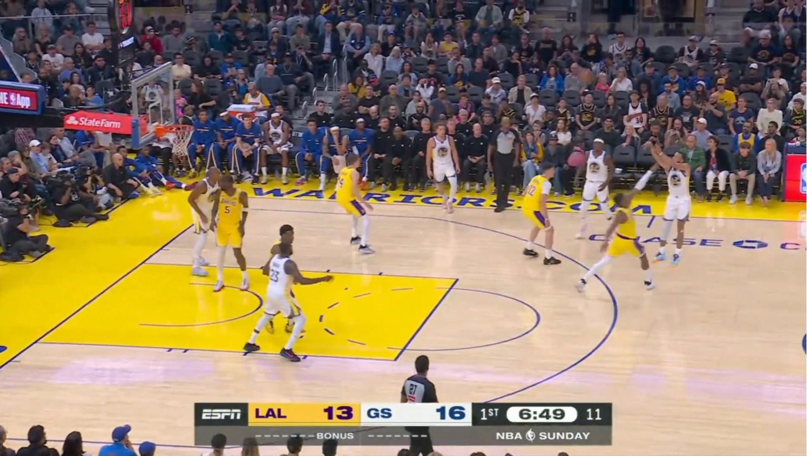

# Proyecto 2

## Ejecución
Para ejecutar el raytracer, corre el archivo `Raytracer2025.py`.
El resultado se guardará automáticamente como `output.bmp` (configurable en `config.py`).

Configuración rápida (archivo `config.py`):
- WIDTH, HEIGHT: resolución de la ventana/render.
- ENVIRONMENT_MAP: elige el HDR dentro de `Enviroment/`.
- CAMERA_POSITION: posición inicial de la cámara.
- PIXELS_PER_FRAME: cantidad de píxeles calculados por frame (render progresivo).

## Resultado y Referencia
<table>
    <tr>
        <td>
            
        </td>
        <td>
            
        </td>
    </tr>
</table>